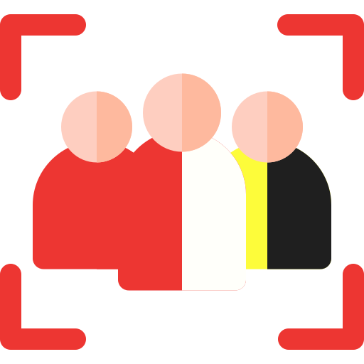
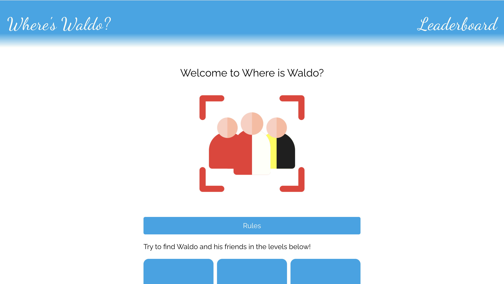

<a id="top"></a>

<div align="center">
    <a href="https://github.com/NestorNebula/where-is-waldo">
        
    </a>
    
<h3>Where's Waldo?</h3>
</div>

## About



This project is a photo tagging app/game inspired by the "Where's Waldo?" books series.

The app consists of a game with multiple levels where the User has to find characters in a photo as quickly as possible.

The user time is then stored and a leaderboard for each level is provided in the app.

### Built With

[](https://nodejs.org/)
[](https://expressjs.com/)
[](https://www.postgresql.org/)
[](https://www.prisma.io/)
[](https://react.dev/)
[](https://vite.dev/)
[](https://vitest.dev/)

#### AND


## Getting Started

### Prerequisites

- NPM
- PostgreSQL database

### Installation

1. Fork the [Project repository](https://github.com/NestorNebula/where-is-waldo)
2. Clone the forked repository to your local machine
   ```
   git clone git@github.com:<your username>/<repo name>.git
   ```
3. Update remote URL

   ```
   # SSH:
   git remote add upstream git@github.com:where-is-waldo/<repo name>.git

   # HTTPS:
   git remote add upstream https://github.com/where-is-waldo/<repo name>.git
   ```

4. Go to the server directory
   ```
   cd server
   ```
5. Create a .env file in the project root directory with the following keys

   ```
   PORT=<PORT>
   DATABASE_URL=<your_db_url>
   ORIGIN1=<your_clientapp_origin>
   ```

6. Install required packages
   ```
   npm install
   ```
7. Go to the client directory and repeat the same process, this time with this key
   ```
   VITE_API_URL=<your_api_url>
   ```
8. Open the app in development mode
   ```
   npm run dev
   ```

If an error occurs, make sure you have done everything properly according to this guide. If you think so, you can <a href="https://github.com/NestorNebula/where-is-waldo/issues">Open an Issue</a>.

## Usage

Once the app, the API and the db are running, you should be able to start the app locally.

Game rules can be found in the app's homepage.

## Contributing

If you find an issue within the app or want to contribute, you can <a href="https://github.com/NestorNebula/where-is-waldo/issues">Open an Issue</a>.

## License

[](https://github.com/NestorNebula/where-is-waldo/blob/main/LICENSE)

## Contact

Noa Houssier - [Github](https://github.com/NestorNebula)

## Acknoledgements

- [Material Design Icons](https://pictogrammers.com/library/mdi/)
- [Faker](https://fakerjs.dev/)
- [Supertest](https://github.com/ladjs/supertest)

<p align='right'>(<a href='#top'>go back to the top</a>)</p>
